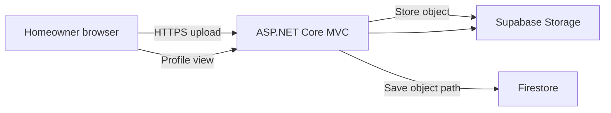
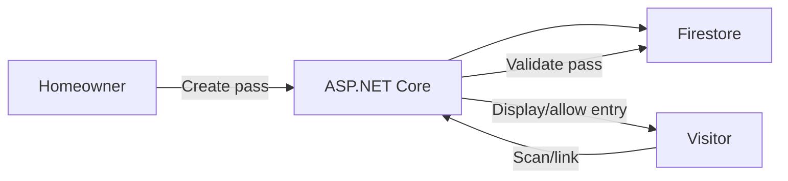

# Diagrams

## Entity Relationship (Firestore data model)
```mermaid
erDiagram
    Homeowner {
      string HomeownerID PK
      string FullName
      string Email
      string ContactNumber
      string Address
      string BlockLotNumber
      string Role
      bool   IsActive
      string ProfileImagePath
    }
    Staff {
      string StaffID PK
      string FullName
      string Email
      string Phone
      string Position
      string Role
      bool   IsActive
      string ProfileImagePath
    }
    Admin {
      string AdminID PK
      string FullName
      string Email
      string Role
      bool   IsActive
    }
    Facility {
      string FacilityID PK
      string FacilityName
      string Description
      int    Capacity
      string Availability
    }
    Reservation {
      string ReservationID PK
      string FacilityID FK
      string HomeownerID FK
      date   ReservationDate
      string Status
      string Notes
    }
    ServiceRequest {
      string RequestID PK
      string HomeownerID FK
      string Category
      string Description
      string Status
      datetime CreatedAt
    }
    VisitorPass {
      string PassID PK
      string HomeownerID FK
      string VisitorName
      date   VisitDate
      string Status
    }
    Vehicle {
      string VehicleID PK
      string HomeownerID FK
      string PlateNo
      string Model
      string Color
      string Status
    }
    Announcement {
      string AnnouncementID PK
      string Title
      string Content
      bool   IsUrgent
      datetime CreatedAt
    }
    ForumPost {
      string PostID PK
      string HomeownerID FK
      string Title
      string Content
      datetime CreatedAt
    }
    ForumComment {
      string CommentID PK
      string PostID FK
      string HomeownerID FK
      string Content
      datetime CreatedAt
    }
    Reaction {
      string ReactionID PK
      string TargetType  // Post or Comment
      string TargetID
      string HomeownerID FK
      string ReactionType
    }
    Event {
      string EventID PK
      string Title
      string Details
      datetime Schedule
    }
    Billing {
      string BillingID PK
      string HomeownerID FK
      string BillType
      decimal Amount
      date   DueDate
      string Status
      string PaymentProofPath
    }
    Notification {
      string Title
      string Message
      string RecipientEmail
      string RecipientPhone
      bool   EmailDelivered
      bool   SmsDelivered
      datetime CreatedAt
    }

    Homeowner ||--o{ Reservation : books
    Homeowner ||--o{ ServiceRequest : submits
    Homeowner ||--o{ VisitorPass : creates
    Homeowner ||--o{ Vehicle : owns
    Homeowner ||--o{ ForumPost : authors
    Homeowner ||--o{ ForumComment : comments
    Homeowner ||--o{ Reaction : reacts
    Homeowner ||--o{ Billing : billed

    Facility ||--o{ Reservation : reserved_by
    ForumPost ||--o{ ForumComment : has
    ForumPost ||--o{ Reaction : receives
    ForumComment ||--o{ Reaction : receives
```

## Request Flow (Admin creates a homeowner)
```mermaid
flowchart LR
    A[Admin browser] -->|HTTPS| B[ASP.NET Core MVC<br/>Render-hosted]
    B -->|Validate auth (Firebase ID token)| C[Firebase Auth]
    B -->|Create user| C
    B -->|Write homeowner doc| D[Firestore]
    A -->|Uploads profile image| B --> E[Supabase Storage]
    B -->|Send SMS onboarding| F[iProgSMS API]
    B -->|Send email onboarding| G[SMTP (Gmail)]
    B -->|Log notification| D
```

## Request Flow (Homeowner profile image upload)


## Request Flow (Visitor pass usage)


# Maintainability Summary
- Codebase: ASP.NET Core MVC with controllers/views and services; external dependencies (Firebase, Supabase, iProgSMS, SMTP) are wrapped in services.
- Configuration: Secrets and keys provided via environment variables and Render Secret Files; no secrets committed.
- Deployment: Dockerized; single Render web service; repeatable builds.
- Data: Firestore for data, Supabase for files; schema and types documented above; no relational migrations needed.
- Logging/ops: ASP.NET Core logging surfaced in Render logs; no external APM currently.
- Secrets rotation: Rotate Gmail app password, iProgSMS token, Firebase service account as needed; update Render env/Secret File and redeploy.

# Maintainability Checklist (to show stakeholders)
- Clear separation: Controllers for routing, services for external APIs (Firebase, Supabase, iProgSMS, SMTP), Razor for views.
- Config-driven: All secrets/keys via env vars and Secret Files; zero secrets in code.
- Single deployable: One Dockerized ASP.NET Core service on Render; consistent across environments.
- Stable data boundaries: Firestore (data) + Supabase (files), documented schema/fields.
- Role enforcement centralized in app; predictable authorization.
- Observable: ASP.NET Core logs visible in Render; (add APM later if needed).
- Small footprint: No separate SPA or multiple microservices; easier to reason about.
